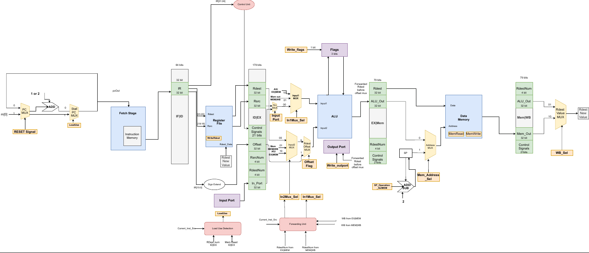

# MIPS 5 Stage Pipelined Processor

#### This is a MIPS 5 stage 32-bit pipelined processor with Harvard architecture, which comes with an assembler to interpret instructions to supported OP codes.

####
## Design


You can check the design <a href="Design.pdf"> here</a>
<br>

## Features
- Supports 8 registers from R1 to R7
- Supports Reset signal
- Reading and writing to ports
- Data hazard detection & handling using:
	- ALU-forwarding
	- Memory-forwarding
  - Stalling for load-use case
- Control hazard detection & handling

## Stages
- Fetch
- Decode
- Execute
- Memory
- Write Back

## IR format

<table border="1" style="text-align:center">
<tr>
<th  style="text-align:center">Instruction Type</th>
<th  style="text-align:center">Immediate or register</th>
<th  style="text-align:center">Code</th>
<th  style="text-align:center">Rdest</th>
<th  style="text-align:center">Rsrc</th>
<th  style="text-align:center">Offset / Immediate value</th>
</tr>

<tr>
<td style="text-align:center">31-30 <br> (2 bits)</td>
<td style="text-align:center">29 <br> (1 bit)</td>
<td style="text-align:center"> 28-24 <br> (5 bits) </td>
<td style="text-align:center">23-20 <br> (4 bits)</td>
<td style="text-align:center"> 19-16 <br> (4 bits) </td>
<td style="text-align:center"> 15-0 <br> (16 bits) </td>
</tr>
</table>


## General components of an instruction opcode

<table border="1" style="text-align:center">
<tr>
<td style="text-align:center">0-operand or 1-operand </td>
<td style="text-align:center">2-operands</td>
<td style="text-align:center">Memory</td>
<td style="text-align:center">Change of control</td>
</tr>

<tr>
<td style="text-align:center">00</td>
<td style="text-align:center">01</td>
<td style="text-align:center">10</td>
<td style="text-align:center">11</td>
</tr>
</table>

## Supported instructions

<table border="1" style="text-align:center;width:100%">
<tr style="text-align:center">
<th  style="text-align:center">No OP</th>
<th  style="text-align:center">One OP</th>
<th  style="text-align:center">Two OP</th>
<th  style="text-align:center">Memory</th>
</tr>

<tr>
<td style="text-align:center">NOP</td>
<td style="text-align:center">CLR</td>
<td style="text-align:center">MOV</td>
<td style="text-align:center">PUSH</td>
</tr>

<tr>
<td style="text-align:center">SETC</td>
<td style="text-align:center">NOT</td>
<td style="text-align:center">ADD</td>
<td style="text-align:center">POP</td>
</tr>

<tr>
<td style="text-align:center">CLRC</td>
<td style="text-align:center">INC</td>
<td style="text-align:center">SUB</td>
<td style="text-align:center">LDD</td>
</tr>

<tr>
<td style="text-align:center"></td>
<td style="text-align:center">NEG</td>
<td style="text-align:center">AND</td>
<td style="text-align:center">STD</td>
</tr>

<tr>
<td style="text-align:center"></td>
<td style="text-align:center">DEC</td>
<td style="text-align:center">OR</td>
<td style="text-align:center"></td>
</tr>

<tr>
<td style="text-align:center"></td>
<td style="text-align:center">OUT</td>
<td style="text-align:center">IADD</td>
<td style="text-align:center"></td>
</tr>

<tr>
<td style="text-align:center"></td>
<td style="text-align:center">IN</td>
<td style="text-align:center">SHL</td>
<td style="text-align:center"></td>
</tr>

<tr>
<td style="text-align:center"></td>
<td style="text-align:center">RLC</td>
<td style="text-align:center">SHR</td>
<td style="text-align:center"></td>
</tr>

<tr>
<td style="text-align:center"></td>
<td style="text-align:center">RRC</td>
<td style="text-align:center">LDM</td>
<td style="text-align:center"></td>
</tr>

</table>

## Run

* Write your program then run the assembler to convert it to binary file
  ```
  python main.py <input_file_path> <output_file_path>
  ```

* Create your project in modelsim with a work library name.
* Add all the .vhd files in [src](src) to the project.

* Compile all files.
* Then start simulation with cpu-arch
* Make sure to change the directory of memory files in the do files before use them.


## Contributors
<table>
  <tr>
    <td align="center">
    <a href="https://github.com/bahaaEldeen1999" target="_black">
    <b>Bahaa Eldeen</b></a>
    </td>
    <td align="center">
    <a href="https://github.com/EmanOthman21" target="_black">
    <b>Eman Othman</b></a>
    </td>
    <td align="center">
    <a href="https://github.com/tarek99samy" target="_black">
    <b>Tarek Samy</b></a>
    </td>
    <td align="center">
    <a href="https://github.com/devyetii" target="_black">
    <b>Ebrahim Gomaa</b></a>
    </td>
  </tr>
 </table>

## License

This software is licensed under MIT License, See [license](LICENSE)
